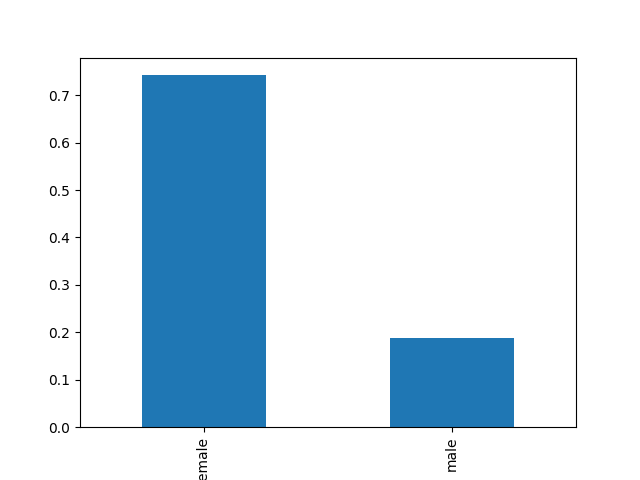
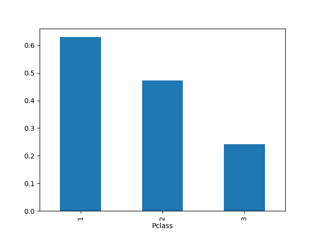
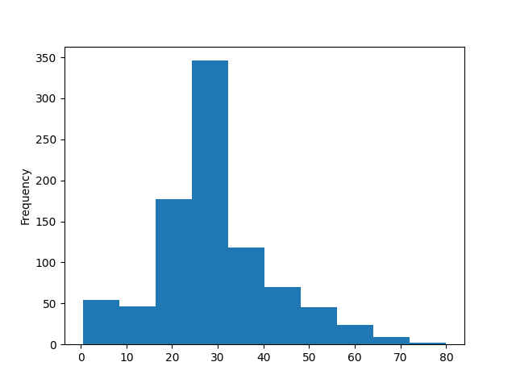

# Titanic Data Analysis

My first data analysis project using Python.

## Tools Used
- Pandas
- Matplotlib
- Jupyter Notebook

## Project Steps
- Load CSV dataset
- Clean missing values
- Analyze survival patterns
- Create 3 charts

## Findings
- Female survival rate was higher than male.
- First class passengers had the highest survival rates.
- Most passengers were between 20–35 years old.
### Survival by Gender

### Survival by Passenger Class

### Age Distribution

